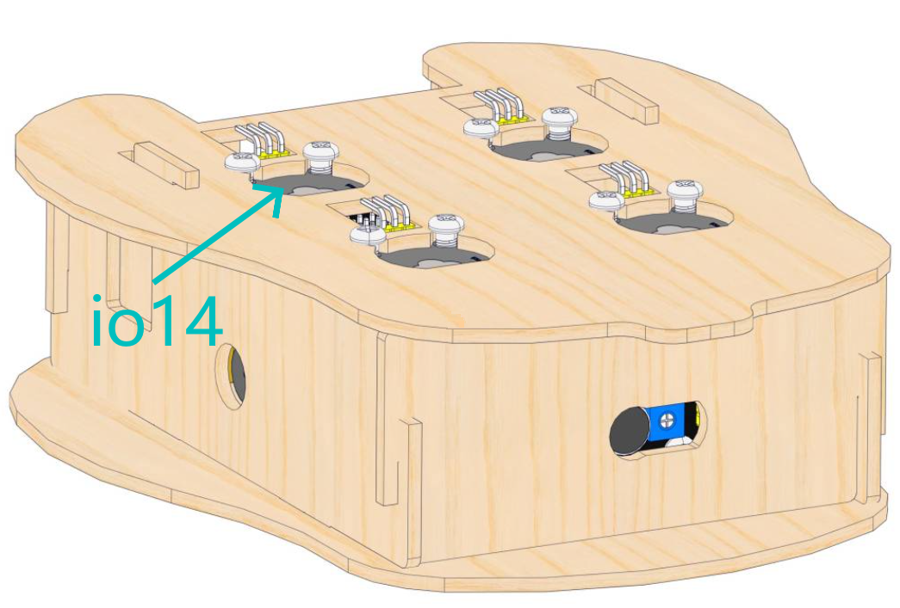
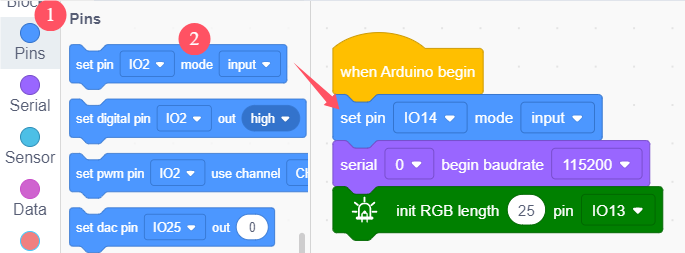
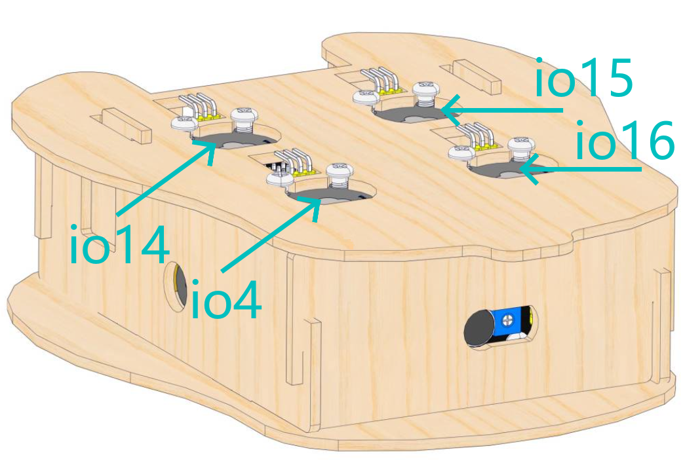
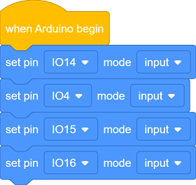
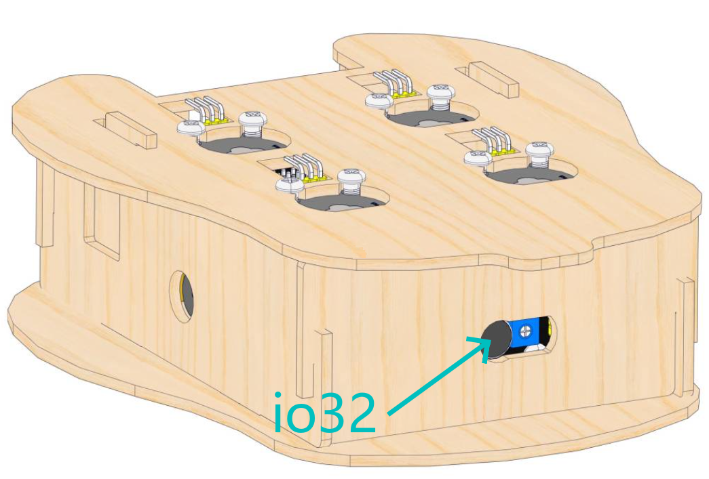
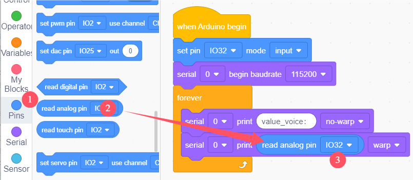
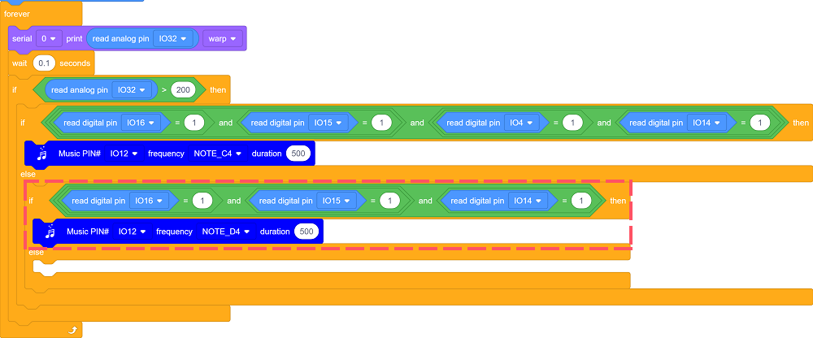

# ESP32 Ocarina

## 1. Projects

**Before learning, please the kit has been assembled!**

### 1.1 Capacitive Touch Module

There is a touch area on the capacitive touch sensor, which can be used as a replacement of traditional buttons, as shown below:

**We can regard the sensor as a button. Touching the area means pressing the button.**

After powering on, it takes about 0.5 seconds for stabilization. During this period, please do not touch this area, because all functions are disabled at this time and self-calibration is always carried out. The calibration period is about 4 seconds.

#### Schematic Diagram

TTP223N-BA6 is a touch pad detector IC that comes with a touch area. The touch detection IC, with various dimensions, can replace the traditional buttons. Its output mode is related to pins TOG and AHLB.

| TOG  | AHLB | Optional Function of Pin Q           |
| ---- | ---- | ------------------------------------ |
| 0    | 0    | Direct mode, available at high level |
| 0    | 1    | Direct mode, available at low level  |
| 1    | 0    | Trigger mode, power-on state is 0    |
| 1    | 1    | Trigger mode, power-on state is 1    |

From the Schematic Diagram, the pin TOG and AHLB are suspended, so the output of this module is direct mode which is available at high level.

When we touch the area on the module (equivalent to pressing the button), the signal S outputs high and the on-board red LED lights up. We can determine whether the capacitive touch module is working by reading the power level of S terminal.

------

#### Parameters

- Operating voltage: DC 3.3 / 5V
- Maximum power: 0.3 W
- Operating temperature: -10°C ~ +50°C
- Output signal: digital signal
- Dimensions: 32 x 24 x 7.3 mm
- Positioning hole: diameter of 4.8 mm
- Interface: 3 pin spacing 2.54 mm

---

#### Wiring Diagram 1

**NOTE:**

| Expansion board pin color | Wire color          | Module terminal |
| ------------------------- | ------------------- | :-------------: |
|        |  |  |
|        |  |  |
|        |  |  |

------
#### Test Code 1

Open KidsBlock and connect the board to your computer. Click **File --> Load from your computer**.

Open code **1.1_1 Capacitive Touch Module.sb3**.

Click  to connect to port, and then  the Test Code.

- Initialization: Set pin mode; initialize serial port and RGB.

  Set pin IO14 to input mode.

  

  

  

  Set baud rate to 115200.

  

  

  Initialize RGB.

  

  

- Loop: Determine whether the area is touched. Touch the area (press the button) to output high 1.

  Build code blocks as follows:

  

  

  

  Build code blocks as follows, and set a condition: pin IO14 outputs value 1.

  

  
  
  
  
- Pressed: ESP32 Easy Coding Board shows a big heart.

  Build code blocks as follows, and adjust the brightness and color of the heart. Click the little square to light up the corresponding RGB.

  

  

- Not pressed: ESP32 Easy Coding Board shows a small heart.

  Click the code block to choose **Duplicate**.

  

  As follows:

  

  Modify the heart icon.

  

  

- Complete Test Code

  

------

#### Test Result 1

Press the button, and ESP32 Easy Coding Board shows a large heart.

Release the button, and ESP32 Easy Coding Board displays a small heart.

---

#### Wiring Diagram 2

**NOTE:**

| Expansion board pin color | Wire color          | Module terminal |
| ------------------------- | ------------------- | :-------------: |
|        |  |  |
|        |  |  |
|        |  |  |

---

#### Test Code 2

Open KidsBlock and connect the board to your computer. Click **File --> Load from your computer**.

Open code **1.1_2 4 keys.sb3**.

Click  to connect to port, and then  the Test Code.

- Initialization: Set pin mode; initialize serial port and RGB.

  Set pin to input mode.

  

  

  Set baud rate to 115200.
  
  
  
  
  
  Initialize RGB.
  
  
  
  
  
  Create four variables: sw1, sw2, sw3, sw4, used to record the number of times of pressing button.
  
  
  
  
  
- Press the button for the first time, and the dot matrix shows 1. Press the button again to clear the dot matrix. 

  Eliminate the button jitters.

  

  

  Each time press the button, and the variable sw1 adds one. Meanwhile, zero out other three variables.

  

  

  When the remainder of "variable sw1 divided by 2" equals 1 (this means sw1 is odd), the dot matrix shows number 1.

  

  

  

  

  When the remainder of "variable sw1 divided by 2" is not 1 (this means sw1 is even), the dot matrix goes off.

  

  

- Similarly, set sw2:

  

  

- sw3:

  

  

- sw4:

  

  

- Complete Test Code:

  

---

#### Test Result 2

Press the button and the dot matrix shows corresponding numbers. Press the button again and the dot matrix is cleared.

------

### 1.2 Sound Sensor

The sound sensor can be regarded as a microphone, which consists of a sensitive capacitive microphone for detecting sound and an amplification circuit.

The sound sensor captures ambient sound due to sound propagation and vibration. When sound travels near the sensor, the sound wave causes the sensor to vibrate. A device inside the sensor converts these vibrations into electrical signals, which are sent to other devices for further processing or analysis.

#### Schematic Diagram

The sound sensor is composed of a high-sensitivity microphone and the LM386 audio power amplifier chip. The former detects the ambient sounds, and the latter amplifies detected sounds.

Rotate the potentiometer on the sensor to adjust the magnification of the amplification. Rotate it clockwise to the end, and the magnification is the largest.

------

#### Wiring Diagram

**NOTE:**

| Expansion board pin color | Wire color          | Module terminal |
| ------------------------- | ------------------- | :-------------: |
|        |  |  |
|        |  |  |
|        |  |  |

------

#### Parameters

- Operating voltage: DC 3.3 / 5V 
- Current: 15 mA
- Maximum power: 0.075 W
- Operating temperature: -10°C ~ +50°C
- Dimensions: 32 x 24 x 11 mm
- Positioning hole: diameter of 4.8 mm
- Interface: 3 pin spacing 2.54 mm

---

#### Test Code 

Open KidsBlock and connect the board to your computer. Click **File --> Load from your computer**.

Open code **1.2 Sound Sensor.sb3**.

Click  to connect to port, and then  the Test Code.

- Initialization: set pin mode and initialize serial port.

  

  

- Print the read analog values on the serial monitor.

  Build code blocks as follows:

  

  Modify the content into *value_voice：* and choose no-wrap printing.

  

  Build code blocks as follows to print the analog value input by pin IO32 on the serial monitor.

  

  

  

- Delay 0.1s after each time the value is read.

  

  

- Complete Test Code

  
  
  

#### Test Result 

NOTE: Before uploading code, please set baud rate first. Or else, garbled words may be shown on the monitor.

Click  to set Buadrate to 115200.

After uploading the code, speak to the MIC. You will see the serial monitor displays the analog values of the sounds converted by the sensor.

------

### 1.3 Passive Buzzer Module

Buzzer is an integrated structure of electronic sound device, which is powered by DC voltage. In application, it is widely used in computers, printers, copiers, alarms, electronic toys, automotive electronic equipment, telephones and timers. 

Buzzers can be divided into active ones(built-in drive circuits) and passive ones(external drive) according to that whether they includes an excitation source.

Active buzzers contain oscillation source inside, which can sound at a fixed frequency once be triggered. They are convenient in program control and features high sound pressure.

Passive ones, however, do not include oscillating sources. If we directly power a passive buzzer via DC voltage, it will emit no sound. According to needs, we generally drive through square waves, whose frequency determines the sound tones.

-------------------

#### Schematic Diagram

Passive buzzer works on the basis of electromagnetic induction, and it is composed of an electromagnetic coil and a vibration sheet. When an electric current passes through the coil, the resulting magnetic field attracts the sheet to vibrate, thus producing sounds. 

The passive buzzer requires an external circuit is required to provide AC signals to emit sound, as they do not integrates oscillating circuits. By controlling the frequency of the AC signals, the tone of the sound can also be changed.

The foundation of music, as we all know, is note. We can compose a variety of melodies and rhythms with different notes. Of all the notes, the most basic are seven: C, D, E, F, G, A, B.

We can compose a variety of melodies and rhythms with these notes.

In the code, there are blocks of notes with three pitches. You can directly drag them to use.

---

#### Wiring Diagram 

**NOTE:**

| Expansion board pin color | Wire color          | Module terminal |
| ------------------------- | ------------------- | :-------------: |
|        |  |  |
|        |  |  |
|        |  |  |

---

#### Parameters

- Operating voltage: DC 3.3 / 5V 
- Operating temperature: -10°C ~ +50°C
- Dimensions: 32 x 24 x 11.5 mm
- Positioning hole: diameter of 4.8 mm
- Interface: 3 pin spacing 2.54 mm

---

#### Test Code 

Open KidsBlock and connect the board to your computer. Click **File --> Load from your computer**.

Open code **1.3 Passive Buzzer.sb3**.

Click  to connect to port, and then  the Test Code.

- Set tones.

  Build code blocks as follows, and set pins, tones and beats.

  

  Click the code block to choose **Duplicate**. Duplicate six blocks and modify their tones.

  

  

- Complete Test Code

  

---

#### Test Result 

The passive buzzer repeatedly plays the set tones.

------

### 1.4 Play The Ocarina

The Ocarina, a worldwide instrument, belongs to any nations. All countries and regions have experienced long or short pottery times documentarily, or learn from each other to reform and develop pottery flutes.

According to the number of holes, ocarinas can be divided into 4 holes, 5 holes, 6 holes, 7 holes, 8 holes, 9 holes, 10 holes, 11 holes, 12 holes, and even 17 holes or more. The most common ones are 6 and 12 holes.

**How to play the ocarina**: 

Your index and middle fingers should be on the holes of the top side. Your ring finger gently holds its bottom to prevent it from falling. Gently cover holes with your finger abdomen rather than fingertips, please do not use too much force. The rest of your fingers should go over the remaining holes.

In this project, we will build a four-hole ocarina. Let's learn how to play!

---

#### Principle

In this project, we build a simulated ocarina with touch sensors, a sound sensor and structural basswood board. 

In this structure, the sound sensor is equivalent to the mouthpiece and windway of an ocarina. Blow into the sound sensor and the output analog value will increase. 

Toneholes are replaced with capacitive touch sensors. High level will output when you touch these sensors.

The passive buzzer plays corresponding tones according to different finger models. The following diagram is the relationship between tones and finger models.

Pin numbers:

Press the certain touch sensor(s) and blow into the sound sensor, and the passive buzzer will emit sounds of corresponding tones.

------

#### Test Code

Open KidsBlock and connect the board to your computer. Click **File --> Load from your computer**.

Open code **1.4 Ocarina.sb3**.

Click  to connect to port, and then  the Test Code.

- Initialization: initialize the serial port and set pin mode.

  

- Print the analog value read by pin IO32 on the serial monitor. The results refresh every 0.1s.

  

- Blow into the mouthpiece (the sound sensor).

  

- At the same time, determine the finger models. And the buzzer will emit sounds of corresponding tones.

  “DO”: Press all toneholes (touch sensors).

  

  

  “RE”: Press toneholes (touch sensors) 1, 3, 4 at the same time.
  
  
  
  
  
  “Mi”: Press toneholes (touch sensors) 1, 2, 3 at the same time.
  
  
  
  
  
  Similarly, set other tones.
  
  
  
  

- Complete Test Code

  

---

#### Test Result 

Press the certain touch sensor(s) and blow into the sound sensor, and the passive buzzer will emit sounds of corresponding tones.

------

## 2. FAQ

### Q: Battery model?

A: Four AAA batteries. Please install the batteries in the correct direction rather than reverse them! For younger students, please be accompanied by your parents!

------

### Q: Errors occur when ESP32 burns code?

A: 

- Please check whether the USB port number is correct.
- Please ensure the main board model is available. 

------

### Q: Expand to external modules?

A: It can expand to external modules. For details, please follow the ESP32 pin instructions to ensure external modules can normally work.

------

## 3. Resources

Keyestudio official:

[https://www.keyestudio.com/](https://www.keyestudio.com/)

Keyestudio wiki main page:

[https://wiki.keyestudio.com/Main_Page](https://www.keyestudio.com/)

ESP32 development board details:

<http://keyestudio-ks0579.readthedocs.io/>

Arduino official:

[https://www.arduino.cc/](https://www.keyestudio.com/)

ESP32 espressif official:

[https://www.espressif.com/](https://www.keyestudio.com/)