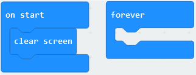
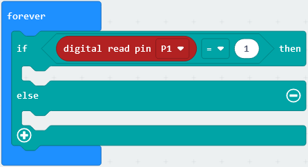
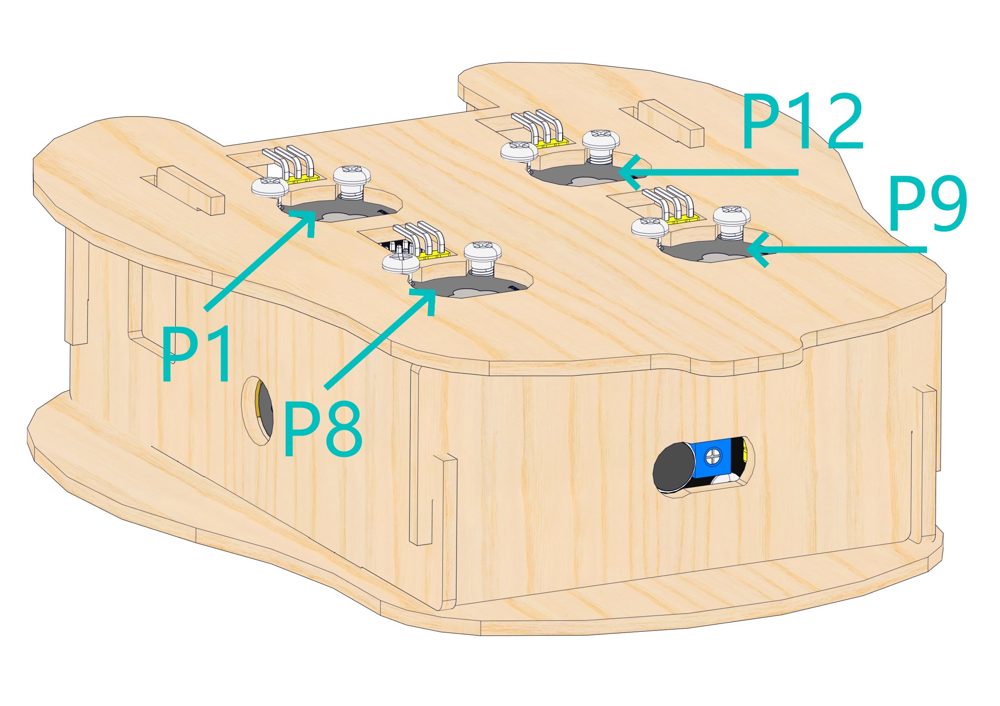
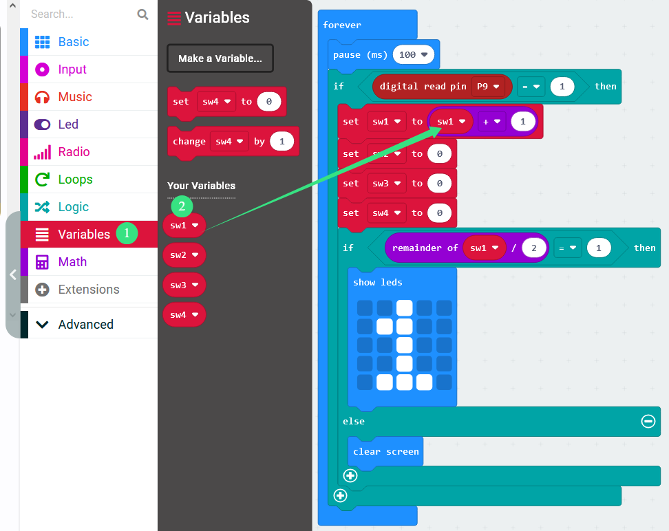
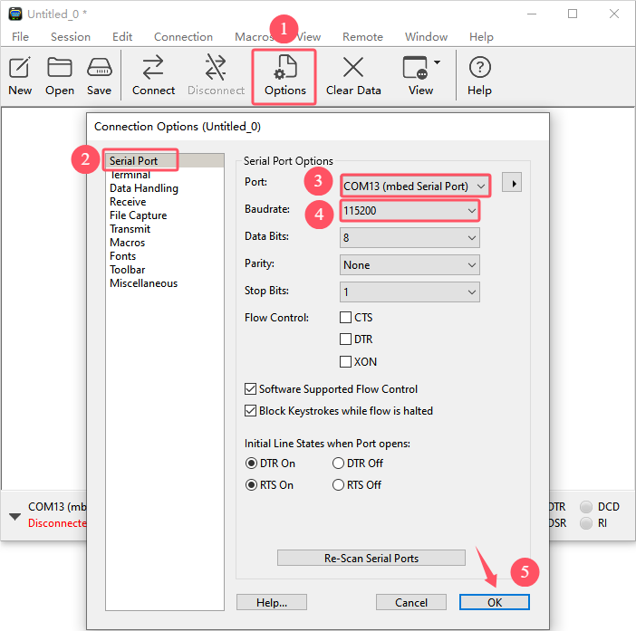
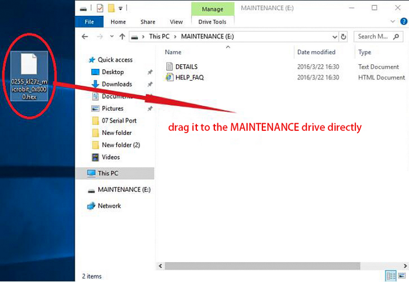

# Micro:bit Ocarina

## 1. Projects

**Before learning, please the kit has been assembled!**

### 1.1 Capacitive Touch Module

There is a touch area on the capacitive touch sensor, which can be used as a replacement of traditional buttons, as shown below:

**We can regard the sensor as a button. Touching the area means pressing the button.**

After powering on, it takes about 0.5 seconds for stabilization. During this period, please do not touch this area, because all functions are disabled at this time and self-calibration is always carried out. The calibration period is about 4 seconds.

#### Schematic Diagram

TTP223N-BA6 is a touch pad detector IC that comes with a touch area. The touch detection IC, with various dimensions, can replace the traditional buttons. Its output mode is related to pins TOG and AHLB.

| TOG  | AHLB | Optional Function of Pin Q           |
| ---- | ---- | ------------------------------------ |
| 0    | 0    | Direct mode, available at high level |
| 0    | 1    | Direct mode, available at low level  |
| 1    | 0    | Trigger mode, power-on state is 0    |
| 1    | 1    | Trigger mode, power-on state is 1    |

From the Schematic Diagram, the pin TOG and AHLB are suspended, so the output of this module is direct mode which is available at high level.

When we touch the area on the module (equivalent to pressing the button), the signal S outputs high and the on-board red LED lights up. We can determine whether the capacitive touch module is working by reading the power level of S terminal.

---

#### Parameters

- Operating voltage: DC 3.3 / 5V
- Maximum power: 0.3 W
- Operating temperature: -10°C ~ +50°C
- Output signal: digital signal
- Dimensions: 32 x 24 x 7.3 mm
- Positioning hole: diameter of 4.8 mm
- Interface: 3 pin spacing 2.54 mm

---

#### Wiring Diagram 1

------
#### Test Code 1

Open makecode on Web or the Windows10 APP, click “Import”.

Click “Import File...”.

Choose file **microbit-1_1.hex** and open.

Or directly drag the file into the New Project box, as follows:

Wait for loading the project code.

- Initialization: clear screen.

  Click **Basic** and drag **clear screen** block into **on start**.

  

  

  

- Loop: Determine whether the area is touched. Touch the area (press the button) to output high 1.

  Click **Logic** and place **if else** block into **forever**.

  

  Set a condition: pin P1 outputs 1.

  Click **Logic** and put **comparision =** block into the condition box of **if else**.

  

  Click **Advanced** and find **Pins**, drag **digital read pin** block into the left box of the **comparision =**, and input 1 in the right box.

  

- Pressed: micro:bit shows a big heart.

  Click **Basic** and drag **show icon** into the **if** part of **if else**.

  

  

  

- Not pressed: micro:bit shows a small heart.

  Similarly, drag **show icon** into the **else** part of **if else** and modify the icon to a small heart.

  

  

- Complete Test Code

  

------

#### Test Result 1

Press the button, and micro:bit shows a large heart.

Release the button, and micro:bit displays a small heart.

---

#### Wiring Diagram 2

---

#### Test Code 2

Open makecode on Web or the Windows10 APP, click “Import”.

Click “Import File...”.

Choose file **microbit-1_2.hex** and open.

Or directly drag the file into the New Project box, as follows:

Wait for loading the project code.

- Initialization: Create four variables: sw1, sw2, sw3, sw4, initial values are 0, used to record the number of times of pressing button.

  Click **Variables** and **Make a Variable...**. We name the variable **sw1**.

  

  Similarly, create variables **sw2**, **sw3**, **sw4**.

  

  

  

- Press the button for the first time, and the dot matrix shows 1. Press the button again to clear the dot matrix. 

  Eliminate the button jitters.

  

  

  Each time press the button, and the variable sw1 adds one. Meanwhile, zero out other three variables.

  

  

  

  

  When the remainder of "variable sw1 divided by 2" equals 1 (this means sw1 is odd), the dot matrix shows number 1.

  

  

  

  When the remainder of "variable sw1 divided by 2" is not 1 (this means sw1 is even), the dot matrix goes off.

  

  

- Similarly, set sw2:

  

  

- sw3:

  

  

- sw4:

  

  

- Complete Test Code

  

---

#### Test Result 2

Press the button and the dot matrix shows corresponding numbers. Press the button again and the dot matrix is cleared.

------

### 1.2 Sound Sensor

The sound sensor can be regarded as a microphone, which consists of a sensitive capacitive microphone for detecting sound and an amplification circuit.

The sound sensor captures ambient sound due to sound propagation and vibration. When sound travels near the sensor, the sound wave causes the sensor to vibrate. A device inside the sensor converts these vibrations into electrical signals, which are sent to other devices for further processing or analysis.

#### Schematic Diagram

The sound sensor is composed of a high-sensitivity microphone and the LM386 audio power amplifier chip. The former detects the ambient sounds, and the latter amplifies detected sounds.

Rotate the potentiometer on the sensor to adjust the magnification of the amplification. Rotate it clockwise to the end, and the magnification is the largest.

------

#### Wiring Diagram

------

#### Parameters

- Operating voltage: DC 3.3 / 5V 
- Current: 15 mA
- Maximum power: 0.075 W
- Operating temperature: -10°C ~ +50°C
- Dimensions: 32 x 24 x 11 mm
- Positioning hole: diameter of 4.8 mm
- Interface: 3 pin spacing 2.54 mm

---

#### Test Code

Open makecode on Web or the Windows10 APP, click “Import”.

Click “Import File...”.

Choose file **microbit-2.hex** and open.

Or directly drag the file into the New Project box, as follows:

Wait for loading the project code.

- Read the analog value of pin P2 and print it on the serial monitor.

- In **Advanced**, click **Serial** and drag **serial write value** block into **forever**.

  

  

  Modify the left box in **serial write value** into *value_voice* 

  

  

  In **Advanced**, clik **Pins** and place **analog read pin** block into the right box of **serial write value**.

  

  

  

- Delay 100ms after each time the value is read.

  Click **Basic** and put **pause(ms)** block into forever.

  

  

  

- Complete Test Code

  

  

#### Test Result

Open **CoolTerm** software and Click **Options**. In the interface, click **SerialPort** to set **COM Port** and **Baudrate(115200)**. (（According to tests, the USB serial port communication baud rate of the micro:bit board is 115200.) Then click **OK** and **Connect**.

CoolTerm serial monitor displays the analog values of the sounds converted by the sensor.

------

### 1.3 Passive Buzzer Module

Buzzer is an integrated structure of electronic sound device, which is powered by DC voltage. In application, it is widely used in computers, printers, copiers, alarms, electronic toys, automotive electronic equipment, telephones and timers. 

Buzzers can be divided into active ones(built-in drive circuits) and passive ones(external drive) according to that whether they includes an excitation source.

Active buzzers contain oscillation source inside, which can sound at a fixed frequency once be triggered. They are convenient in program control and features high sound pressure.

Passive ones, however, do not include oscillating sources. If we directly power a passive buzzer via DC voltage, it will emit no sound. According to needs, we generally drive through square waves, whose frequency determines the sound tones.

-------------------

#### Schematic Diagram

Passive buzzer works on the basis of electromagnetic induction, and it is composed of an electromagnetic coil and a vibration sheet. When an electric current passes through the coil, the resulting magnetic field attracts the sheet to vibrate, thus producing sounds. 

The passive buzzer requires an external circuit is required to provide AC signals to emit sound, as they do not integrates oscillating circuits. By controlling the frequency of the AC signals, the tone of the sound can also be changed.

The foundation of music, as we all know, is note. We can compose a variety of melodies and rhythms with different notes. Of all the notes, the most basic are seven: C, D, E, F, G, A, B.

We can compose a variety of melodies and rhythms with these notes.

In the code, there are bolcks of seven notes. You can directly drag them to use.

---

#### Wiring Diagram 

---

#### Parameters

- Operating voltage: DC 3.3 / 5V 
- Operating temperature: -10°C ~ +50°C
- Dimensions: 32 x 24 x 11.5 mm
- Positioning hole: diameter of 4.8 mm
- Interface: 3 pin spacing 2.54 mm

---

#### Test Code

Open makecode on Web or the Windows10 APP, click “Import”.

Click “Import File...”.

Choose file **microbit-3.hex** and open.

Or directly drag the file into the New Project box, as follows:

Wait for loading the project code.

- Click **Music** and drag **play** block into **forever**.

  

  

- Set tones. 

  Click the following part: 

  

  Compose a melody as you like. 

  

  

- Complete Test Code

  

---

#### Test Result

The passive buzzer repeatedly plays the melody you set.

------

### 1.4 Play The Ocarina

The Ocarina, a worldwide instrument, belongs to any nations. All countries and regions have experienced long or short pottery times documentarily, or learn from each other to reform and develop pottery flutes.

According to the number of holes, ocarinas can be divided into 4 holes, 5 holes, 6 holes, 7 holes, 8 holes, 9 holes, 10 holes, 11 holes, 12 holes, and even 17 holes or more. The most common ones are 6 and 12 holes.

**How to play the ocarina**: 

Blow into the mouthpiece at the windway. Gently cover holes with your finger abdomen rather than fingertips, please do not use too much force. 

------

#### Principle

In this project, we build a simulated ocarina with touch sensors, a sound sensor and structural basswood board. 

In this structure, the sound sensor is equivalent to the mouthpiece and windway of an ocarina. Blow into the sound sesnor and the output analog value will increase. 

Toneholes are replaced with capacitive touch sensors. High level will output when you touch these sensors.

The passive buzzer plays corresponding tones according to different finger models. The following diagram is the relationship between tones and finger models.

Pin numbers:

Press the certain touch sensor(s) and blow into the sound sensor, and the passive buzzer will emit sounds of corresponding tones.

------

#### Test Code

Open makecode on Web or the Windows10 APP, click “Import”.

Click “Import File...”.

Choose file **microbit-4.hex** and open.

Or directly drag the file into the New Project box, as follows:

Wait for loading the project code.

- Initialization: clear screen

  

  

- Print the analog value read by pin P2 on the serial monitor. The results refresh every100ms.

  

    

- Blow into the mouthpiece (the sound sensor).

  

  

- At the same time, determine the finger models. And the buzzer will emit sounds of corresponding tones.

  “DO”: Press all toneholes (touch sensors).

  
  
  
  
  “RE”: Press toneholes (touch sensors) 1, 3, 4 at the same time.
  
  
  
  
  
  “Mi”: Press toneholes (touch sensors) 1, 2, 3 at the same time.
  
  
  
  
  
  Similarly, set other tones.
  
  
  
  

- Complete Test Code

  

---

#### Test Result

Press the certain touch sensor(s) and blow into the sound sensor, and the passive buzzer will emit sounds of corresponding tones.

------

## 2. Troubleshooting

### 2.1  Code fails to download to Micro:bit

#### Problem

Recently, many users encounter the issue that Micro:bit board doesn’t respond when download code.

If the way you operate is correct, maybe you accidentally press the reset button and enter the Maintenance mode or the firmware is lost due to mis-operation.

Plug in Micro:bit board, the “MAINTENANCE” drive appears, which means the program can’t be downloaded.

#### Solution

1. Download the **hex file** from this page to your computer.

	Down load the latest micro:bit firmware-0255: https://www.microbit.org/get-started/user-guide/firmware/ 
	If you do not want to download from this website, we also provide it in our tutorial.

2. After the latest firmware is downloaded, then drag it into the “MAINTENANCE” to make Micro:bit back to normal mode.

#### Avoid to Enter “MAINTENANCE”

1. Make sure the Reset button is **not** pressed when plugging the board by USB cable.

      
      
2. Don't unplug the cable suddenly during downloading micro:bit program, otherwise, the firmware will be lost and micro:bit will enter “MAINTENANCE” mode.
3. In the experiment, wrong wiring also cause a short circuit or firmware lost.

------

### 2.2 Troubleshooting-Download with WebUSB

Having trouble pairing the Micro: bit with WebUSB (/ device/usb/webusb)?

#### Step 1: Check cable

Make sure that your micro:bit is connected to your computer with a micro USB cable. You should see a **MICROBIT** drive appear in Windows Explorer when it’s connected.

**If you can see the MICROBIT, please go to step 2**.

If you can’t:

- Make sure that the USB cable is working. Does the cable works on another computer? If not, find a different cable to use. Some cables may only provide a power connection and don’t actually transfer data.
- Try another USB port on your computer. Is the cable good but you still can’t see the **MICROBIT** drive? Hmm, you might have a problem with your micro:bit. Try the additional steps described in the [falut finding](https://support.microbit.org/support/solutions/articles/19000024000-fault-finding-with-a-micro-bit) at microbit.org.
- If this doesn’t help, you can create a [support ticket](https://support.microbit.org/support/tickets/new) to notify the Micro:bit Foundation of the problem. If you do so, **skip the rest of these steps**.

#### Step 2: Check firmware version

It’s possible that the firmware version on the micro:bit needs an update. Let’s check:

1. Go to the **MICROBIT** drive.
2. Open the **DETAILS.TXT** file.

3. Look for the version number. It should say **Version: ...**

	

	Or **Interface Version: ...**

	

	If the version is **0234**, **0241**, **0243**, you need to update the firmware on your micro:bit. Go to **Step 3** and follow the upgrade instructions.

	If the version is **0249**, **0250** or higher, you have the right firmware, just go to **step 4**.

#### Step 3: Update firmware

1. Put your micro:bit into **MAINTENANCE Mode**. 

	To do this, please unplug the USB cable from the micro:bit and then re-connect the USB cable after pressing and holding the reset button. Once you insert the cable, you can release the reset button. You should now see **MAINTENANCE** instead of the **MICROBIT** drive. Also, a yellow LED indicator will stay on. 

2. Download firmware .hex file: <https://microbit.org/guide/firmware/>
3. Drag the file into the **MAINTENANCE** drive.
4. The yellow LED will flash while the HEX file is copying. After that, the LED will go off and the micro:bit resets. The **MAINTENANCE** drive now changes to **MICROBIT**.
5. The upgrade is complete! You can open the **DETAILS.TXT** file to check the firmware version that matches the one of the **HEX** file you copied.

If you want to know more about connecting the board, MAINTENANCE Mode, and upgrading the firmware, please refer to [Firmware guide](https://microbit.org/guide/firmware/).

#### Step 4: Check version of Browser

WebUSB may require you to update your browser. 

Check that your browser version matches one of these: **Android**, **Chrome OS**, **Linux**, **macOS** and **Windows 10 Chrome 65+**.

#### Step 5: Pair device

Once you’ve updated the firmware, open the **Chrome Browser**, go to the editor and click on **Pair Device** in settings. 

See [WebUSB](https://microbit.org/get-started/user-guide/web-usb/) (/ device / usb / webusb) for pairing instructions.

-------------

### 2.3 Battery model?

Four AAA batteries. Please install the batteries in the correct direction rather than reverse them! For younger students, please be accompanied by your parents!

------

## 3. Resources

Keyestudio official:

[https://www.keyestudio.com/](https://www.keyestudio.com/)

Keyestudio wiki main page:

[https://wiki.keyestudio.com/Main_Page](https://www.keyestudio.com/)

MicrobitCode:

<https://makecode.microbit.org/>

Microbit Official:

<https://www.microbit.org/>