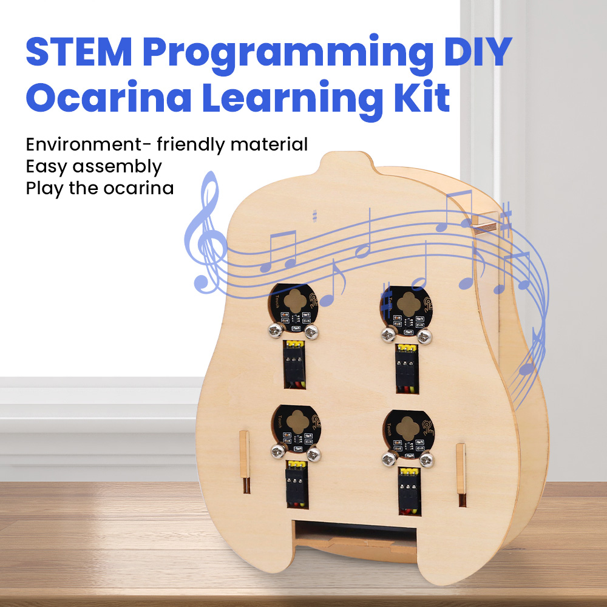
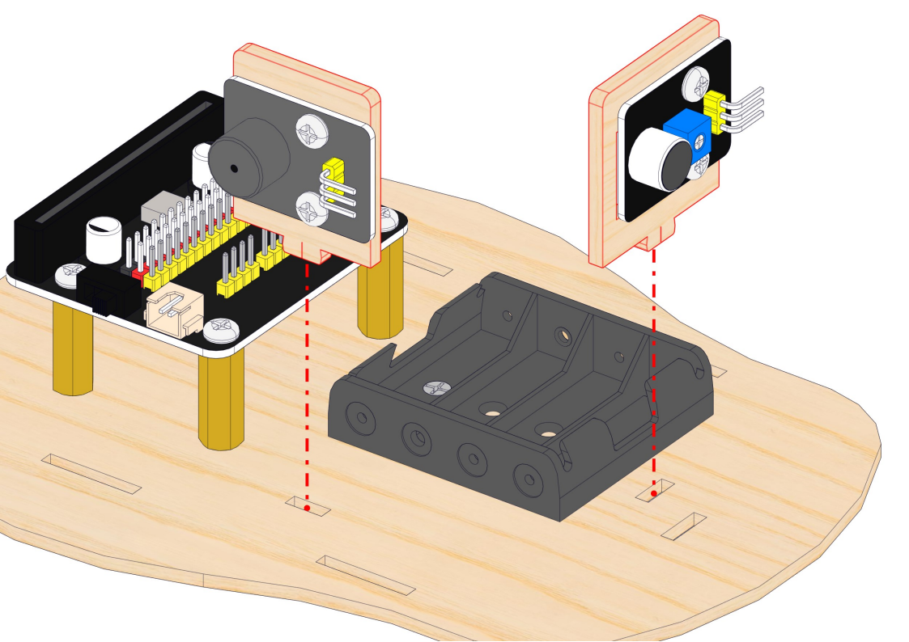
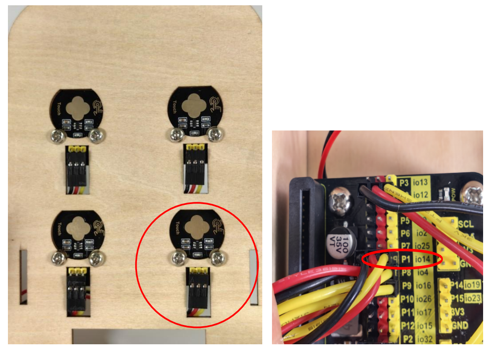

**Thank you for choosing keyestudio!**

**We will endeavor to provide you with better products and services!**

------

**About Keyestudio**

Keyestudio is the best-selling brand owned by KEYES Corporation. Our product contains Arduino development and expansion boards, sensors and modules, Raspberry Pi, micro:bit expansion boards as well as smart cars and learning kits, which can help customers at any level to learn about Arduino.

Notably, all of our products are in line with international quality standards and are greatly appreciated in a broad menu of different markets across the world.

Welcome to check out more contents from our official website:

<a href="http://www.keyestudio.com" target="_blank">http://www.keyestudio.com</a>

------

**Obtain Information and After-sales Service**

1. If something is found missing or broken, or you have some difficulty learning the kit, please feel free to contact us. Welcome to send email to us: [service@keyestudio.com](http://m.138.gz.cn/webadmin/~CAmsnCrrNXhTAySKCerrIfWjjZuuWVfI/~/usr/mod_edituser.jsp?;uid=service@keyestudio.com;;clearCache=)

2. We will endeavor to update projects and products continuously from your sincere advice! Thanks!

------

**Warning**

1. This product contains tiny pin headers, so please keep out of reach of children under 7 to prevent from lacerations. 
2. This product also contains conductive parts(control board and electronic modules). Please operate according to the requirements of tutorials. Otherwise, improper operation may damage parts due to overheating. In this case, do not touch it and immediately disconnect the circuit power.

------

**Copyright**

The Keyestudio trademark and logo are the copyright of **KEYES DIY ROBOT co.,LTD**. All products under Keyestudio brand can’t be copied, sold or resold without authorization by anyone or any company.

If you are interested in our products, please contact to our sales representatives:

[fennie@keyestudio.com](http://m.138.gz.cn/webadmin/~CAmsnCrrNXhTAySKCerrIfWjjZuuWVfI/~/usr/mod_edituser.jsp?;uid=fennie@keyestudio.com;;clearCache=)

------

# STEM Programming DIY Ocarina Learning Kit

------

## Kit List

**Please check the list to ensure that all parts are intact. If you find missing ones, please contact our sales staff immediately.**

|  #   |                   PIC                   |           NAME           | QTY  |
| :--: | :-------------------------------------: | :----------------------: | :--: |
|  1   |                       |     Expansion board      |  1   |
|  2   |                | Capacitive Touch Sensor  |  4   |
|  3   |                |      Passive Buzzer      |  1   |
|  4   |                |       Sound Sensor       |  1   |
|  5   |   .png)   |     3PIN DuPont wire     |  6   |
|  6   |                | M4*8MM round head screw  |  20  |
|  7   |                        |          M4 nut          |  12  |
|  8   |            | M2.5*8MM flat head screw |  2   |
|  9   |                    |         M2.5 nut         |  2   |
|  10  |  |  M4*20MM Copper Pillar   |  4   |
|  11  |                      |         Basswood         |  4   |
|  12  |                      |       Screwdriver        |  1   |
|  12  |                       |      Battery holder      |  1   |

------

## Description

With bass wood as its structural material, we specially design an ocarina learning kit.

This kit integrates 4 capacitive touch sensor, a sound sensor and a passive buzzer, which are compatible with micro:bit boards and ESP32 Easy Coding Boards. We write codes via Makecode and KidsBlock to play musics or to achieve more creative and interesting functions.

With this kit, you can master basic sensor knowledge and have an excellent opportunity to learn programming. Except for the composition of musics, it is also a perfect combination of learning and entertainment which stimulates your creativity and talent.

------

## Features

1. **Simple assembly:** For convenience, the assembly is easy and simple so that you may complete installations quickly.
2. **Experience of ocarina:** You can play music by the ocarina and enjoy the fun of music show.
3. **Combination of programming and music:** It integrates musics with programming, providing you with a novel and creative programming experience.
4. **Multiple programming:** Makecode and KidsBlock programming are available, which meet the diversified programming needs and expand the range of learning.

------

## Assembly

### step 1:  Mount Battery Holder to the Base Board

------

------

------

------

------

------

Pay attention to the direction of the battery holder (its power cable).

------

---

### step 2: Mount Passive Buzzer & Sound Sensor, Wire up

------

------

------

------

------

------

---

Wiring of The Passive Buzzer

| Expansion Board Pin Color |     Wire Color      |   Module Pin    |
| :-----------------------: | :-----------------: | :-------------: |
|        |  |  |
|        |  |  |
|        |  |  |

------

Wiring of The Sound Sensor

| Expansion Board Pin Color |     Wire Color      |   Module Pin    |
| :-----------------------: | :-----------------: | :-------------: |
|        |  |  |
|        |  |  |
|        |  |  |

### step 3: Install Walls of the Ocarina

------

------

------

------

------

------

------

### step 4: Mount Capacitive Touch Sensors, Wiring up

------

------

Wire up first and then mount them to the board.

|     Wire Color      |   Module Pin    |
| :-----------------: | :-------------: |
|  |  |
|  |  |
|  |  |

------

------

------

------

------

------

------

------

-----------

Four AAA batteries are required. No anti-reverse function is integrated to the holder, so please do not reverse batteries!

Connect the power cable of the holder to the expansion board correctly. 

### step 5: Install the Top Board

------

------

Push the board in the direction of the arrow to tighten it. 

------

### step 6: Insert Main Control Board

ESP32 Easy Coding Board:

------

Microbit:

## Resources

[https://www.keyestudio.com/](https://www.keyestudio.com/)

[https://wiki.keyestudio.com/Main_Page](https://wiki.keyestudio.com/Main_Page)

[Micro:bit Educational Foundation | micro:bit (microbit.org)](https://microbit.org/)

<https://tech.microbit.org/hardware/>

<https://microbit.org/new-microbit/>

<https://www.microbit.org/get-started/user-guide/overview/>

<https://microbit.org/get-started/user-guide/features-in-depth/>

[https://www.espressif.com/](https://www.espressif.com/)

------

## Tutorials

### 1. Basic Projects

Basic projects include development board introduction, programming methods, the ways of burning codes and the usage of sensors and modules. You will have a clear understanding on the board functions.

**If you are a beginner, please firstly read the introduction and using methods of development board (Micro:bit /ESP32Easy Coding Board) to learn how to program on software and how to upload code.**

[Basic Courses:Microbit](./Microbit/Basic_Courses.md)

<!--[Basic Courses:ESP32 Easy Coding Board](./ESP32/Basic_Courses.md)-->

### 2. Ocarina Projects

Do operations according to the tutorials of the two development boards.

#### 1. Microbit

[Micro:bit](Microbit/Microbit_Ocarina.md)

#### 2. ESP32 Easy Coding Board

<!--[ESP32](ESP32/ESP32_Ocarina.md)-->

------

